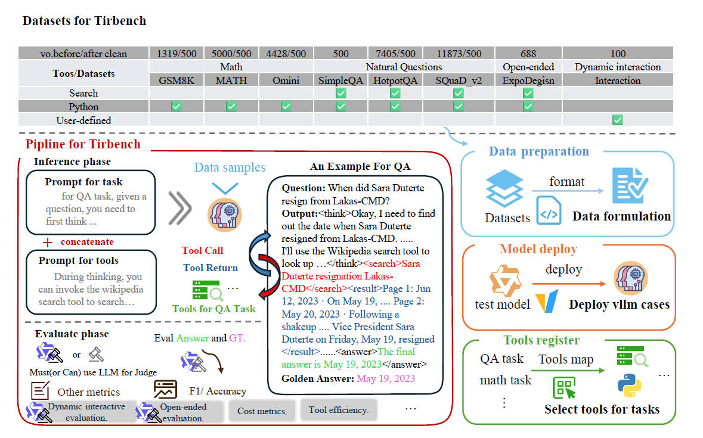

# 💡 TIRBench: A Benchmark for Tool-Integrated Reasoning

<p align="center">
  <a href="#citation"></a>
  <a href="#quick-start"></a>
  <a href="#quick-start"></a>
  <a href="#supported-datasets"></a>
  <a href="#adding-configurations"></a>
  <a href="#citation"></a>
</p>

## [Overview](#overview)

TIRBench is a benchmark for evaluating whether large language models can solve math, QA, open-ended, and dynamic interaction tasks while using external tools effectively. It supports local vLLM deployment, OpenAI-compatible remote APIs, asynchronous inference, tool-augmented and no-tool settings, and task-specific evaluation. The main entry points are `deploy.py` for model deployment, `infer.py` for inference, and `evaluate.py` for evaluation.



## [Table of Contents](#table-of-contents)

- [Overview](#overview)
- [Supported Datasets](#supported-datasets)
- [Quick Start](#quick-start)
- [Configuration](#configuration)
- [Metrics](#metrics)
- [Reproducing Paper Results](#reproducing-paper-results)
- [Citation](#citation)

## [Supported Datasets](#supported-datasets)

| Category | Dataset config | Data directory | Typical tools |
| --- | --- | --- | --- |
| Math | `math500` | `data/math/` | Python |
| Math | `gsm8k500` | `data/gsm8k/` | Python |
| Math | `omini500` | `data/omini/` | Python |
| Natural Questions | `simpleqa` | `data/SimpleQA/` | Search, Python |
| Natural Questions | `hotpotqa` | `data/hotpotqa/` | Search, Python |
| Natural Questions | `squadv2` | `data/squadv2/` | Search, Python |
| Open-ended | `expodesign` | `data/expodesign/` | Search, Python |
| Dynamic interaction | `interaction` | `data/interaction/` | User-defined interaction tools |

Additional data folders such as `aime24`, `aime25`, `2wiki`, `bamboogle`, `gaia`, `hle`, and `musique` are also included and can be connected by adding dataset YAML files under `src/config/dataset_config/`.

## [Quick Start](#quick-start)

Create a clean Python environment and install dependencies.

```bash
conda create -n eval python=3.10 -y
conda activate eval

pip install -r requirements.txt
```

Before running the local example, download Qwen3-4B to your machine and set the local model path in `src/config/llm_config/Qwen3_4B.yaml` by updating `model_path`. Also adjust `vllm.gpu_ids` to match your available GPU devices.

Run a complete local vLLM experiment on `math500`.

```bash
python deploy.py --config Qwen3_4B

python infer.py \
  --llm_config Qwen3_4B \
  --dataset_config math500 \
  with use_tool=true

python evaluate.py \
  --llm_config Qwen3_4B \
  --dataset_config math500 \
  with use_tool=true

bash scripts/clean.sh
```

For remote OpenAI-compatible models, set `vllm.remote: true`, `endpoints`, and `api_keys` in the corresponding LLM config. Remote models do not need `deploy.py`; run inference and evaluation directly.

```bash
python infer.py \
  --llm_config my_remote_model \
  --dataset_config math500 \
  with use_tool=true

python evaluate.py \
  --llm_config my_remote_model \
  --dataset_config math500 \
  with use_tool=true
```

## [Configuration](#configuration)

The benchmark uses YAML configuration files plus Sacred command-line overrides.

Configuration files are loaded in this order:

1. `src/config/default.yaml`
2. `src/config/llm_config/<llm_config>.yaml`
3. `src/config/dataset_config/<dataset_config>.yaml`
4. Sacred overrides after the `with` keyword

Later values override earlier values.

### [Model Configuration](#model-configuration)

Local vLLM model configs live in `src/config/llm_config/`. For example:

```yaml
llm_name: qwen3_4b
model_path: /path/to/Qwen3-4B
default_model: Qwen3-4B
max_concurrent_requests: 32

vllm:
  remote: false
  host: 0.0.0.0
  port: 8001
  gpu_ids: "0"
  tensor_parallel_size: 1
  max_model_len: 32768
  gpu_memory_utilization: 0.9
  endpoints: ["http://127.0.0.1:8001/v1"]
  api_keys: []
```

For a remote OpenAI-compatible API, set `vllm.remote: true` and provide your own endpoint and API key:

```yaml
llm_name: my_remote_model
default_model: my-served-model-name
max_concurrent_requests: 8

vllm:
  remote: true
  endpoints:
    - https://your-api-endpoint/v1
  api_keys:
    - YOUR_API_KEY
```

Do not commit private API keys to a public repository. Replace any placeholder keys in local configs before running experiments.

### [Dataset Configuration](#dataset-configuration)

Dataset configs live in `src/config/dataset_config/`. A minimal math config looks like:

```yaml
dataset_name: math
prompt_type: math
sample_timeout: 1200
task: math
timeout: 18000
```

The corresponding data files are under `data/`.

### [Adding Configurations](#adding-configurations)

To add a new dataset, place the data under `data/<dataset_name>/` and add a dataset YAML file under `src/config/dataset_config/<dataset_config>.yaml`. At minimum, specify `dataset_name`, `prompt_type`, and `task`.

```yaml
dataset_name: my_dataset
prompt_type: qa
task: qa
sample_timeout: 1200
timeout: 1800
```

To add a new model, create an LLM YAML file under `src/config/llm_config/<model_config>.yaml`. Set `llm_name`, `default_model`, and either a local `model_path` with a `vllm` block or remote API endpoints.

Global defaults, including tool settings, can be edited in `src/config/default.yaml`. You can also override any runtime option directly from the CLI after `with`. For example:

```bash
python infer.py \
  --llm_config Qwen3_4B \
  --dataset_config hotpotqa \
  with use_tool=true max_python_times=5 max_search_times=3 max_read_times=3 sample_timeout=1200
```

## [Metrics](#metrics)

The evaluator computes task-dependent correctness metrics and tool-use metrics. Depending on the task and available fields, outputs may include:

- exact match and F1 for QA tasks
- math equivalence for math tasks
- LLM-judge scores for tasks that require model-based evaluation
- reasoning-answer consistency
- tool support rate
- Python/search tool call counts
- tool efficiency
- total and average inference time
- estimated token counts when a tokenizer is configured

To enable tokenizer-based token estimation, provide `tokenizer_path`:

```bash
python evaluate.py \
  --llm_config Qwen3_4B \
  --dataset_config math500 \
  with use_tool=true tokenizer_path="/path/to/tokenizer_or_model"
```

## [Reproducing Paper Results](#reproducing-paper-results)

For each reported model and dataset:

1. Create or verify the model config in `src/config/llm_config/`.
2. Create or verify the dataset config in `src/config/dataset_config/`.
3. Run inference with `use_tool=true`.
4. Run inference with `use_tool=false` for the baseline.
5. Run `evaluate.py` on both output sets.
6. Report the aggregate metrics from `*_metrics_overall.json`.

Recommended output organization:

```text
results/
├── tool/
│   └── <model_name>/
│       ├── <dataset>_output.json
│       ├── <dataset>_output_metrics.json
│       └── <dataset>_output_metrics_overall.json
└── notool/
    └── <model_name>/
        ├── <dataset>_output.json
        ├── <dataset>_output_metrics.json
        └── <dataset>_output_metrics_overall.json
```

## [Citation](#citation)

If you use this benchmark in your research, please cite our paper:

```bibtex
@article{yourpaper2026tirbench,
  title   = {TIRBench: A Benchmark for Tool-Integrated Reasoning},
  author  = {Author One and Author Two and Author Three},
  journal = {arXiv preprint arXiv:XXXX.XXXXX},
  year    = {2026}
}
```
